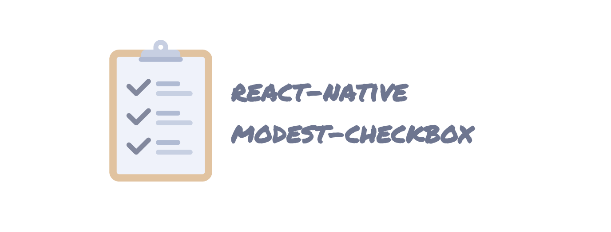
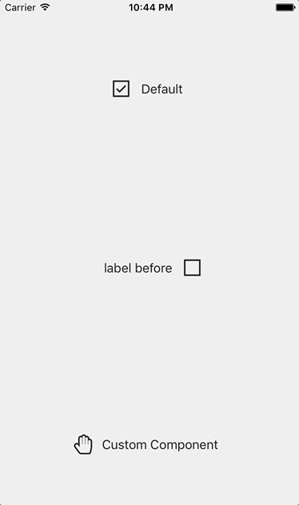

<div align="center">
  
</div>
<br>
<div align="center">
  <strong>A modest checkbox component for React Native</strong>
</div>
<br>
<div align="center">
    <a href="https://npmjs.org/package/react-native-modest-checkbox">
      
    </a>
    <a href="https://npmjs.org/package/react-native-modest-checkbox">
    
    </a>
    <a href="https://github.com/feross/standard">
      
    </a>
    <a href="https://travis-ci.org/tiaanduplessis/react-native-modest-checkbox">
      
    </a>
    <a href="https://github.com/RichardLitt/standard-readme)">
      
    </a>
    <a href="https://badge.fury.io/gh/tiaanduplessis%2Freact-native-modest-checkbox">
      
   </a>
</div>

<h2>Table of Contents</h2>
<details>
  <summary>Table of Contents</summary>
  <li><a href="#about">About</a></li>
  <li><a href="#install">Install</a></li>
  <li><a href="#usage">Usage</a></li>
  <li><a href="#props">Props</a></li>
  <li><a href="#contribute">Contribute</a></li>
  <li><a href="#license">License</a></li>
</details>

## About

A customizable checkbox component for React Native that supports setting a custom image or component as the checkbox. Inspired by [react-native-checkbox](https://github.com/sconxu/react-native-checkbox).

## Install

```sh
$ npm install --save react-native-modest-checkbox
```

```sh
$ yarn add react-native-modest-checkbox
```

## Usage

<div align="center">
  
</div>

```js
// ... Imagine imports here
import Checkbox from 'react-native-modest-checkbox'

export default class App extends Component {
  render() {
    return (
      <View style={styles.container}>
        <Checkbox
          label='Text for checkbox'
          onChange={(checked) => console.log('Checked!')}
        />
      </View>
    );
  }
}

const styles = StyleSheet.create({
// Imagine some amazing styles right here..
})

AppRegistry.registerComponent('App', () => App);

```

You can use your own images for the checkbox states:

```js
<CheckBox checkedImage={require('./path/to/image.png')} uncheckedImage={require('./path/to/otherImage.png')} />
```

It can also be used with your own components for the checkbox states:

```js
// Using react-native-vector-icons

<CheckBox
  checkedComponent={<Icon name="hand-peace-o" size={25} color="#222" />}
  uncheckedComponent={<Icon name="hand-paper-o" size={25} color="#222" />}
  label='Custom Component'
  onChange={(checked) => console.log('Checked!')}
/>

```

## Props

<table style="width:80%">
  <tr>
    <th>Property</th>
    <th>Description</th>
    <th>Default Value</th>
  </tr>
  <tr>
    <td><code>checkedComponent</code></td>
    <td>Custom component representing the checked state</td>
    <td><code>&lt;Text&gt;Checked&lt;/Text&gt;</code></td>
  </tr>
  <tr>
    <td><code>uncheckedComponent</code></td>
    <td>Custom component representing the unchecked state</td>
    <td><code>&lt;Text&gt;Unchecked&lt;/Text&gt;</code></td>
  </tr>
  <tr>
    <td><code>checked</code></td>
    <td>Checked value of checkbox</td>
    <td><code>false</code></td>
  </tr>
  <tr>
    <td><code>checkboxStyle</code></td>
    <td>Styles applied to the checkbox</td>
    <td><code>{ width: 30, height: 30 }</code></td>
  </tr>
  <tr>
    <td><code>label</code></td>
    <td>Text that will be displayed next to the checkbox</td>
    <td><code>'Label'</code></td>
  </tr>
  <tr>
    <td><code>customLabel</code></td>
    <td>Customize label using React Component</td>
    <td><code>null</code></td>
  </tr>
  <tr>
    <td><code>labelBefore</code></td>
    <td>Flag if label should be before the checkbox</td>
    <td><code>false</code></td>
  </tr>
  <tr>
    <td><code>labelStyle</code></td>
    <td>Styles applied to the label</td>
    <td><code>{fontSize: 16, color: '#222'}</code></td>
  </tr>
  <tr>
    <td><code>numberOfLabelLines</code></td>
    <td>The number of lines over which the label will be displayed</td>
    <td><code>1</code></td>
  </tr>
  <tr>
    <td><code>containerStyle</code></td>
    <td>Styles applied to the container of label & checkbox</td>
    <td><code>{ flexDirection: 'row', alignItems: 'center'}</code></td>
  </tr>
  <tr>
    <td><code>checkedImage</code></td>
    <td>Image representing checked state (e.g. <code>require('./path/to/image.png')</code>)</td>
    <td><code>checked.png</code></td>
  </tr>
  <tr>
    <td><code>uncheckedImage</code></td>
    <td>Image representing unchecked state (e.g. <code>require('./path/to/image.png')</code>)</td>
    <td><code>unchecked.png</code></td>
  </tr>
  <tr>
    <td><code>onChange</code></td>
    <td>Callback that will be invoked when the checked state has changed. receives a object with <code>name</code> & <code>checked</code> properties as arguments</td>
    <td><code>none</code></td>
  </tr>
    <tr>
    <td><code>noFeedback</code></td>
    <td>Use <code>TouchableWithoutFeedback</code> as container of checkbox</td>
    <td><code>false</code></td>
  </tr>
</table>

## Contribute

Contributions are welcome. Please open up an issue or create PR if you would like to help out.

Note: If editing the README, please conform to the [standard-readme](https://github.com/RichardLitt/standard-readme) specification.

## License

Licensed under the MIT License.

Icon made by <a href="http://www.freepik.com" title="Freepik">Freepik</a> from <a href="http://www.flaticon.com" title="Flaticon">www.flaticon.com</a> is licensed by <a href="http://creativecommons.org/licenses/by/3.0/" title="Creative Commons BY 3.0" target="_blank">CC 3.0 BY</a>.
